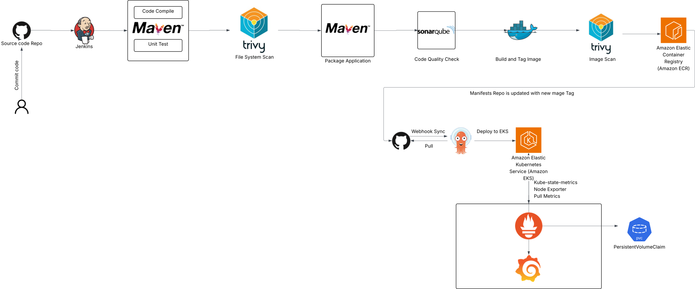
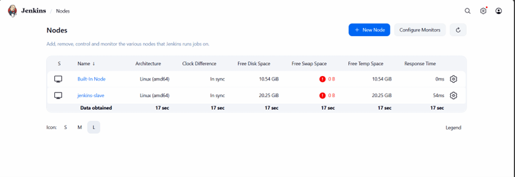
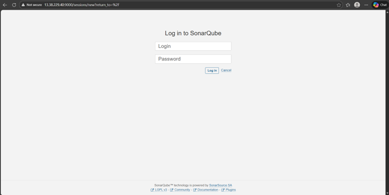
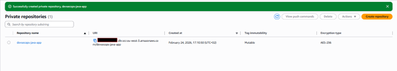
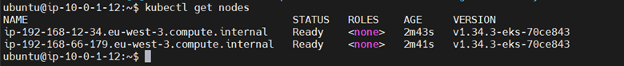
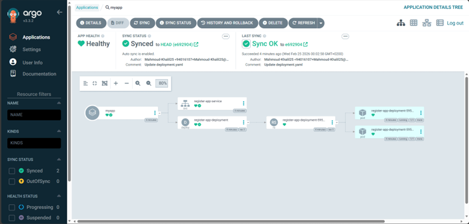

# Enterprise DevSecOps CI/CD Pipeline on Amazon EKS

This project demonstrates a complete **DevSecOps CI/CD platform** implementing secure application delivery from source code to Kubernetes deployment using **Jenkins, SonarQube, Trivy, AWS ECR, GitOps with ArgoCD, and Kubernetes monitoring with Prometheus and Grafana**.

The architecture follows **GitOps deployment principles**, automated security scanning, and Kubernetes observability.

---

# Architecture Overview

Pipeline flow:

Developer → GitHub → Jenkins Master → Jenkins Slave Agent → Maven Build → SonarQube Analysis → Trivy Security Scan → Docker Image Build → AWS ECR → GitOps Repository → ArgoCD → Amazon EKS → Prometheus → Grafana

---

# Infrastructure Setup

| Component | Instance Type | Purpose |
|----------|---------------|--------|
| Jenkins Master | t2.medium | CI/CD orchestrator |
| Jenkins Slave | t2.medium | Build and pipeline execution |
| SonarQube | t2.medium | Code quality analysis |
| Bootstrap Server | t2.micro | EKS provisioning |
| Amazon EKS | Managed | Kubernetes runtime |

All instances were deployed on **Ubuntu 24.04 EC2**.

---

# Jenkins Master-Agent Architecture

The pipeline uses a **Jenkins master-agent model**.

The Jenkins master orchestrates jobs while a dedicated **Jenkins slave agent executes build tasks, Docker operations, and security scans**.

---

# CI Pipeline Stages

The Jenkins pipeline automates the following stages:

1. Cleanup Workspace  
2. Checkout Source Code  
3. Compilation (Maven)  
4. Unit Testing  
5. Trivy Filesystem Security Scan  
6. Build Application Package  
7. SonarQube Code Analysis  
8. Quality Gate Validation  
9. Docker Image Build  
10. Trivy Container Image Scan  
11. Push Image to AWS ECR  
12. Update GitOps Repository  
13. ArgoCD Deployment to EKS  

---

# Static Code Analysis (SonarQube)

SonarQube is integrated with Jenkins to enforce code quality checks and prevent low-quality builds from progressing through the pipeline.

---

# Security Scanning (Trivy)

Security scanning is integrated directly into the CI pipeline using **Trivy**.

Two scans are performed:

• Filesystem scan before build  
• Container image scan after Docker build

---

# Container Registry (AWS ECR)

Docker images are pushed to **Amazon Elastic Container Registry (ECR)** after passing all security and quality checks.

---

# Kubernetes Cluster (Amazon EKS)

The Kubernetes cluster was provisioned using **eksctl** and contains a managed node group for running workloads.

---

# GitOps Deployment (ArgoCD)

The deployment follows **GitOps principles**.

Jenkins updates the Kubernetes manifest repository with the new image tag, and **ArgoCD automatically synchronizes the desired state to the EKS cluster**.

---

# Monitoring and Observability

Cluster monitoring is implemented using **Prometheus and Grafana**.

The monitoring stack was deployed using the **kube-prometheus-stack Helm chart**.

---

# Skills Demonstrated

• Jenkins pipeline design  
• DevSecOps security integration  
• GitOps continuous deployment  
• Kubernetes cluster deployment  
• Container registry management  
• Infrastructure provisioning using eksctl  
• Monitoring with Prometheus and Grafana  

---

# Project Status

This repository documents the architecture, pipeline design, and captured results of the DevSecOps platform implementation.

The cloud infrastructure used during development has been **decommissioned**, but the repository preserves the full design, configuration steps, and deployment workflow.

---

# Author

Mahmoud Khalil  
DevOps Engineer

LinkedIn:  
https://www.linkedin.com/in/mahmoud-ahmed-14a011190